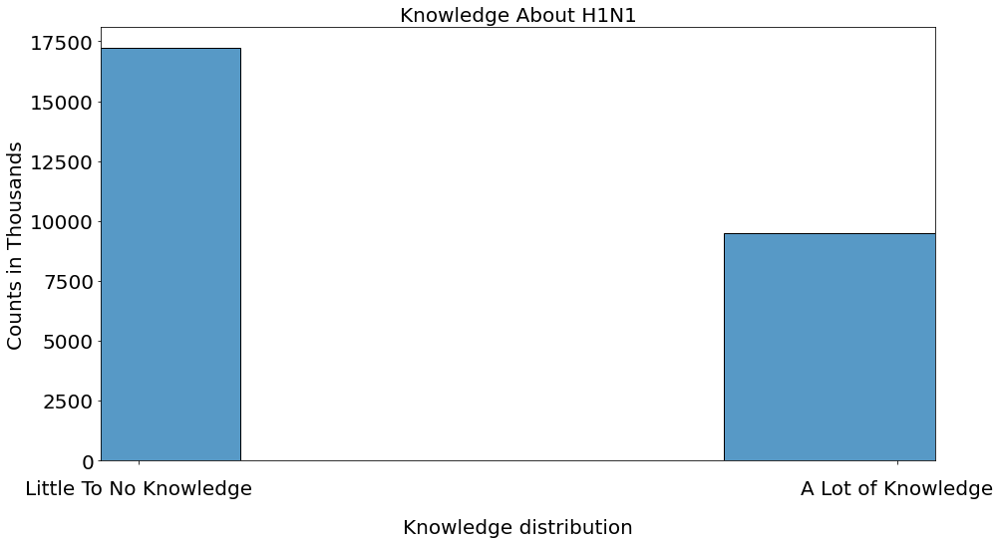
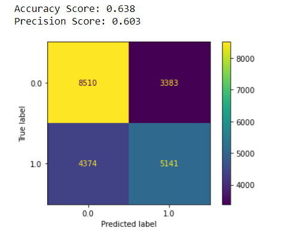

  
# Phase 3 - Project 3 - Tackling Flu and Vaccine Misinformation
# Project Team:
- [**Ilene Sorto**](https://github.com/ileneee)
- [**Peter Vuong**](https://github.com/petercvuong)
---
# Table of Contents
 - [Overview](#1-overview)
 - [Business Understanding](#2-business-understanding)
 - [Data](#3-data)
 - [Modeling](#4-modeling)
 - [Evaluation](#5-evaluation)
 - [Conclusion](#6-conclusion)
 - [Repo Navigation](#repo-navigation)
---

## 1. Overview
---
Our goal for this project is to identify important factors that may contribute to the spread of misinformation and provide some recommendations to the CDC to educate uninformed individuals with the appropriate information so that they can make the best informed decisions for their health. We gathered this data from 2009 dataset to predicted what features are most influential in determining a respondents knowledge of the H1N1 flu and vaccine.

---
## 2. Business Understanding
---
In a day and age where information is available everywhere, it can be difficult to filter out truth from fiction. The spread of misinformation is a widespread problem that affects people daily. False information leads to misinformed decisions that will lead to detrimental outcomes. Considering recent events, the spread of vaccine and disease misinformation has led to lead to hundreds of thousands of hospitilizations and deaths.  

The stakeholder for this project is none other than the Center for Disease Control and Prevention, otherwise known as the **CDC**. The goal of this project is to create a model that would assist in accurately identifying features from survey respondents that would mostly contribute to a respondent's lack of information.

Since this data is from a survey response, it does not give an accurate reflection of the situation and community at the time. The data also has a pretty obvious class imbalance and some clear biases.

---
## 3. Data
---
The data used in this project comes from the [DataDriven]() website as part of a competition. This data is from a 2009 survey response.  
**Data Limitations:**
- Since this data is from a survey response in 2009, it only gives a snapshot of a point in time and thus does not accurately reflect the situation and communities.
- The data has a pretty noticeable class imbalance of our target variable.
- At this point in time, the survey responses indicate that there are some biases present so the data does not accurately reflect the general public.
 

Shown below is the graph of the distribution of the data after binning the responses into little to no knowledge vs. a lot of knowledge.

---
## 4. Modeling
---

We completed some preliminary EDA and data cleaning to remove features that we deemed unnecessary in our project. We decided to focus on precision and accuracy as our evaluation metrics. Precision is important to us in this project because it assists in identifying false positives in the dataset. A false positive in this dataset would mean that based on the survey response the respondent is knowledgeable about the H1N1 flu and vaccine when in reality they are not.   

For our baseline model, we created a `DummyClassifier` model that would correctly classify our target variable 50% of the time.  

The final model that we implemented was a `LogisiticRegression` model with optimized hyperparameters from the `GridSearchCV` function. This model produced an accuracy score of 64% and a precision score of 60%. 

---
## 5. Evaluation
---

The model that performed best on our dataset was the `LogisticRegression` model with optimized hyperparameters. This model produced an accuracy score of 64% and a precision score of 60%. This model also helped us identify some important features based on their coefficients. If respondents indicated that `education_level < 12 years`, they were **0.49x** as likely to be knowledgeable about H1N1 and its vaccine. Similarly, if a respondent indicated that they were a `male`, they were **0.89x** as likely to be as knowledgeable about H1N1 and its vaccine.

---
## 6. Conclusion
---
Overall, the final model has potential in assisting the CDC identify communities that may need extra assistance and funding.  

Based on the data, we would recommend that:
-  For the CDC to implement a PR campaign about the H1N1 flu and vaccine. This campaign will aim to provide the correct information and readily available sources for the entire public. Increasing accessibility to educational resources is essential in combatting misinformation.

- Ensuring that those who responded as concerned about H1N1 know that there is a vaccine available. Respondents should also know that they can speak to their doctors about any concerns they may have since `doctor_opinion` is also an important feature in determining a respondent's knowledge.

- Ensure that the right resources and education are provided to underrepresented and disadvantaged communities. 

Some future considerations we would like to consider:
- Promoting the same awareness and knowledge for modern pandemics such as COVID-19. We can create a survey that has similar features and implement any new modern health concerns (like mental health).

- New research and survey data that has already been collected can be analyzed to predict similar targets(especially now since information in this day and age is so readily available and is susceptible to being classified as misinformation)

- We can also utilize this data to invest in more promotional material to increase awareness in the underepresented communities since the responses in the  were not reflective of the community as a whole.

# Repo Navigation
├── [data/](https://github.com/petercvuong/Phase_3_Project/tree/main/data)    -------------------------------------> Data used for this project collected by DrivenData.

├── [pictures/](https://github.com/petercvuong/Phase_3_Project/tree/main/pictures) --------------------------------------> Visualizations used in the presentation and README.md.
 (logos and images used in README have URL associated with image source in markdown)

├── [.gitignore](https://github.com/petercvuong/Phase_3_Project/blob/main/.gitignore  ) ---------------------------------> .gitignore used for the project.

├── [Final_Notebook - Jupyter Notebook.pdf](https://github.com/petercvuong/Phishing-Detector-Capstone/blob/main/Final%20Phishing%20Capstone%20Notebook%20-%20Jupyter%20Notebook.pdf)            ---> A PDF of the final project notebook.

├── [Final Phishing Capstone Notebook.ipynb](https://github.com/petercvuong/Phase_3_Project/blob/main/Project%203%20Final%20Notebook.ipynb)              ---------------------> The jupyter notebook containing the finalized code.

├── [Web Phishing Detector Presentation.pdf](https://github.com/petercvuong/Phishing-Detector-Capstone/blob/main/Web%20Phishing%20Detector%20Presentation.pdf)              --------------------------> A PDF of the presentation.

├── [README.md](https://github.com/petercvuong/Phishing-Detector-Capstone/blob/main/README.md)              ------------------------------> README.md for the project (you are here now).