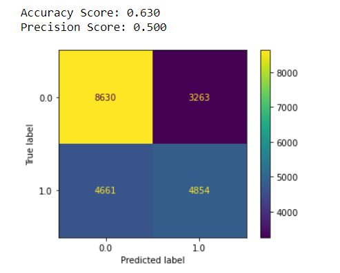

  
# Phase 3 - Project 3 - Tackling Flu and Vaccine Misinformation
# Project Team:
- [**Ilene Sorto**](https://github.com/ileneee)
- [**Peter Vuong**](https://github.com/petercvuong)
# Navigating the Repository 
All the detailed data for this project can be found in the file [`Project 3 Final Notebook`](https://github.com/petercvuong/Phase_3_Project/blob/main/Project%203%20Final%20Notebook.ipynb).  And the presentation can be found here [**Google Slides**](https://docs.google.com/presentation/d/1LN7rHov2PxvCMZwtCcUwQ_xf3KQoEdOk30RdmkQHtWw/edit#slide=id.g35f391192_00)
# Resources 
The dataset used for this project were from the [**Driven Data**](https://www.drivendata.co/blog/predict-flu-vaccine-data-benchmark/) 
# Introduction
Our goal for this projct is for the CDC provide the population with the appropriate information that is needed to make the best informed decisions for their health.
In order to make the best decisions the public needs the correct information. We this 2009 dataset we predicted what features are mosot influential in determining a respondents knowledge of the H1N1 flu and vaccine.

Since this data is from a survey response, it does not give an accurate reflection of the situation and community at the time. The data also has a pretty obvious class imbalance and some clear biases.
# 
# Preparing For Modeling  
First we loaded in the datasets `data/training_set_features.csv` and `data/test_set_features.csv` to explore and clean  the data before we start modeling. The data had already been split into train test split for us but not every feature is needed for our specific business problem. The next step was to identify which features those were. 

These were the most important columns that would help us answer our business problem as they can tell us which contribute to vaccine and H1N1 knowledge. We then turned those into the X train and made H1N1 knowledge the y train. After we noticed that we had missing values and decided the best course of action was to simple impute those values inot the most frequent values since it would keep the distribution consistent. We noticed that some of the columns in our X train were objects and not floats as you can see from the picture above. We had to one hot encode those values into a binary since the models we are running are classification models that only deal with binaries.

After one hot encoding we binned the column knowledge of H1N1 instead of 3 values to combine the 0 no knowledge and  1 little to no knowledge to just 0 since both groups are prone to misinformation and make 1 to a lot knowledge. 

After binning the two values we noticed class imbalance between little to no knowledge and a lot knowledge. We used `SMOTE` to address the issue and decided to undersample our 0 class of little to no knowledge in both our trainig and test set.

Lastly before modeling we used an `Extra Tree Classifier` to identify which features were most important to our respondents 

We found some of the important features for the respondents were:

- Respondent's worry of getting sick from taking H1N1 vaccine

- Respondent's opinion about H1N1 vaccine effectiveness.

- Concern about H1N1

- Respondent's opinion about risk of getting sick with H1N1 flu without vaccine

- Respondent's worry of getting sick from taking seasonal flu vaccine

#
# Modeling 
First we want to create a `DummyClassifier` model that will serve as the baseline for our model performance comparison while also using percision as our main metric because it highlights false positives which is people who say they know a lot about h1n1 really don't can lead to misinformation . Our  `DummyClassifier` model in this case would mean that based on the given data, the dummy model would correctly identify our predictions 50% of the time and our percision score being 44%.
 After running a basline model our first model would be a  `Decision Tree Classifier` to identify the most important features and then run a `Logistic Regression model` 

 The results from our weren't the best as it only increased to 56% from our dummy classifier
 
 

 After we decided a `GridSearchCV` to find the optimial hyperparameters to pass into our `Decision Tree Classifier`. After we run our GridSearchCV, we print out the best_params_, best_score_, and the best_estimator_ to get the optimal parameters and metrics based on the grid search results. From the results we see that our accuracy score increased.
 
 

 Our final model being a `Logistic Regression` to find our best predictions. We plot out the confusion matrix and produce the metrics to see that our model is accurate in predicting whether a respondent is knowledgeable about H1N1 or not about 64% of the time. This is a 14% increase from our baseline model. The precision of this model also increased about 10% meaning that our model correctly identifies knowledgeable respondents 60% of the time.

The precision increase to 60% is important to us because in our models we would like to focus more on those who responded that they are knowledgeable about H1N1 Flu and Vaccine, but in reality they are not knowledgeable at all (False Negative).

We also identify the coefficients in this array produced by our model. We want to identify the lowest coefficient and take the power of that coefficient in order to produce an odds value. We identified the lowest cofficients was `education_< 12 years` meaning if a surveyor responded with the education less than 12 years they were **0.42x** likely to be knowledgeable about the vaccine. Other significant findings were if the surveyor responded male they were about **0.63x** as likely to be knowledgeable about the H1N1 Flu and Vaccine.  Also Income below poverty are about 0.56x as likely to be knowledgeable about the H1N1 Flu and Vaccine.
#
# Graphing 
Below are some of the important features that can lead to misinformation: overall knowledge of H1N1 and concern for H1N1 as they both can lead to misinformation.

We found that a majority of respondents either indicated that they were somewhat concerned or very concerned.

Over 65% of the respondents know little to nothing about H1N1, which coincides with our findings from the previous graph. These findings show us that even though a majority of respondents are somewhat concerned or very concerned, a majority of these self-same respondents also claim to have little to no knowledge of the H1N1 flu and vaccine as well.

We want to arm these unknowledgeable respondents with properly sourced information so that they can protect themselves (especially considering that the H1N1 Flu had a 100,000 to 500,000 mortality in the US since it was discovered).
  
  The fact that a majority of respondents have little to no knowledge AND are somewhat-very concerned about the H1N1 flu means that there are likely more respondents who identify as false negatives.

  # 
  # Conclusion
  We ran a couple of models to see what would produce the best accuracy and precision score. The Logistic Regression model performed the best between the models by producing an accuracy score of 64% and a precision score of 60%.

The Logistic Regression model also gave us coefficients that would help us identify the features that would most influential on a respondents knowledge of the H1N1 Flu and vaccine.

Some of these features include:

- Income

- Education Level

- Sex

As always we have to remember that since this is a survey response dataset, there are inherent biases that are present. We should avoid making generalizations based on sensetive features such as sex and race; however, it may be important to identify these features as areas of focus/improvement for the CDC to allocate more resources and funding so that these underrepresented communities receive the same knowledge and opportunities.
# Recommendations
- For the CDC to implement a PR campaign about the H1N1 flu and vaccine. This campaign will aim to provide the correct information and readily available sources for the entire public. Increasing accessibility to educational resources is essential in combatting misinformation.

- Making sure that those who responded as concerned about the flu know that there is a vaccine for this flu and that if needed they can talk to their doctors about any concerns because doctor opinion is an important predictor of determining a respondent's knowledge.

- Making sure the right resources are allocated so that those with less than 12 years of education are well informed like people with higher education
# Future Considerations 
The next steps we'd like to implement

- Promoting the same awareness for modern pandemics such as COVID-19. We can create a survey that has similar features and implement any new modern health concerns (like mental health for example)

- Similar surveys can be conducted and research data that has already been collected can be analyzed to predict similar targets(especially now since information in this day and age is so readily available and is prone to misinformation)

- We can also utilize this data to invest in more promotional material to increase awareness in the underepresented communities since the dataset was so imbalanced.

# Repo Navigation
├──data. 
├──pictures  
├──Working Notebooks
├──.gitignore. 
├──Project 3 Final Notebook.ipynb.
├──Phase 3 Presentation.pdf 
├──README.md. 
